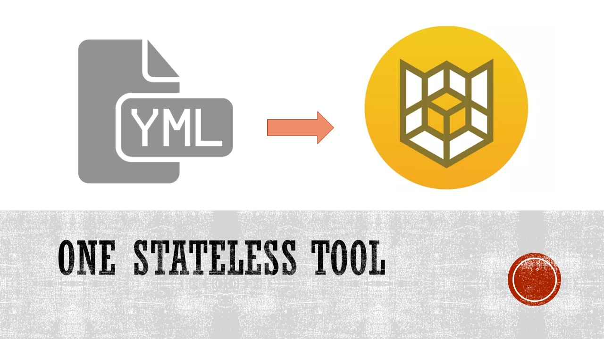
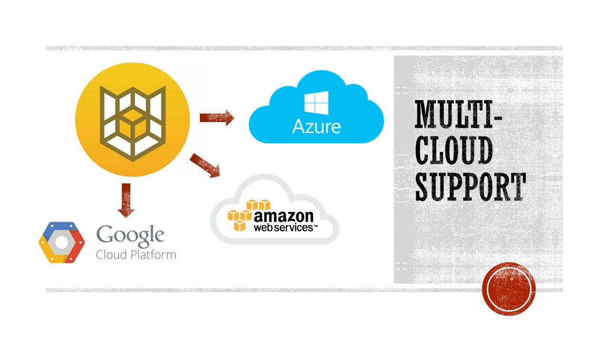

# CloudCustodianAzureGuide
Guide to Cloud Custodian on Azure

Custodian uses a flexible query language for filtering resources to a particular subset that allows for compound querying. This essentially allows you to filter for things like instances with attached Azure Blob Storage disks or stopped instances. This filtering can take into account external data sources. It also provides for resource specific actions around deletion, stopping, starting, encryption, tagging, etc.

The stateless design of Custodian greatly simplifies feature development and operations. It also provides flexibility around execution environment (local cli, vm-based server or serverless container).

When a user runs Custodian, Custodian will run the specified policy against the account and region specified by the user. Custodian will iterate over all resources defined in the policy. In the CLI, users specify the account and region they want to target. During the run, each policy in the config will generate metrics that are sent to **TO-DO: Azure flow? ** in the account that is targeted. 

The run will also generate structured record output and logs that can be sent to an Azure Blob Storage Account object. in the account Custodian was run from. 

If Custodian is being run without **TO-DO: Azure flow?**  Assume Roles, all output will be put into the same account. 

Custodian is built with the ability to be run from different accounts and leverage STS Role Assumption for cross-account access. Users can leverage the metrics that are being generated after each run by creating Custodian Dashboards in **TO-DO Azure flow?** Azure OMS (other?).
## Introduction

### Architecture

### Component Overview

### Process flow

### CC mechanics (eg, how it works)

## Getting Started

[Getting Started and writing your first policy]( https://cloudcustodian.io/docs/azure/gettingstarted.html)

[Authentication](https://cloudcustodian.io/docs/azure/authentication.html)

[Basic Examples](https://cloudcustodian.io/docs/azure/examples/index.html)

[Advanced Usage](https://cloudcustodian.io/docs/azure/advanced/index.html)

## Cloud Custodian Drill down

### Policy

### Filters

### Action

## Advanced topics

### Related services 
#### Eg, frontend-public-ip on https://cloudcustodian.io/docs/azure/policy/resources/loadbalancer.html 

### Metrics

### Mailer

### Azure Functions

### Blob Storage

### Dev Install (Windows, Linux, Mac)